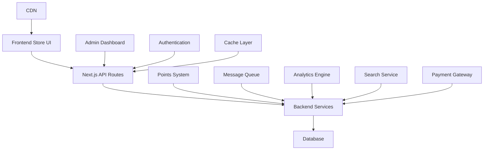
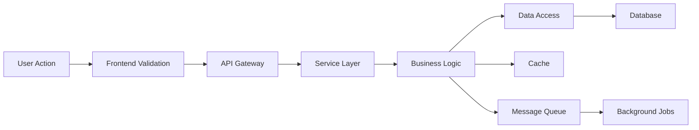
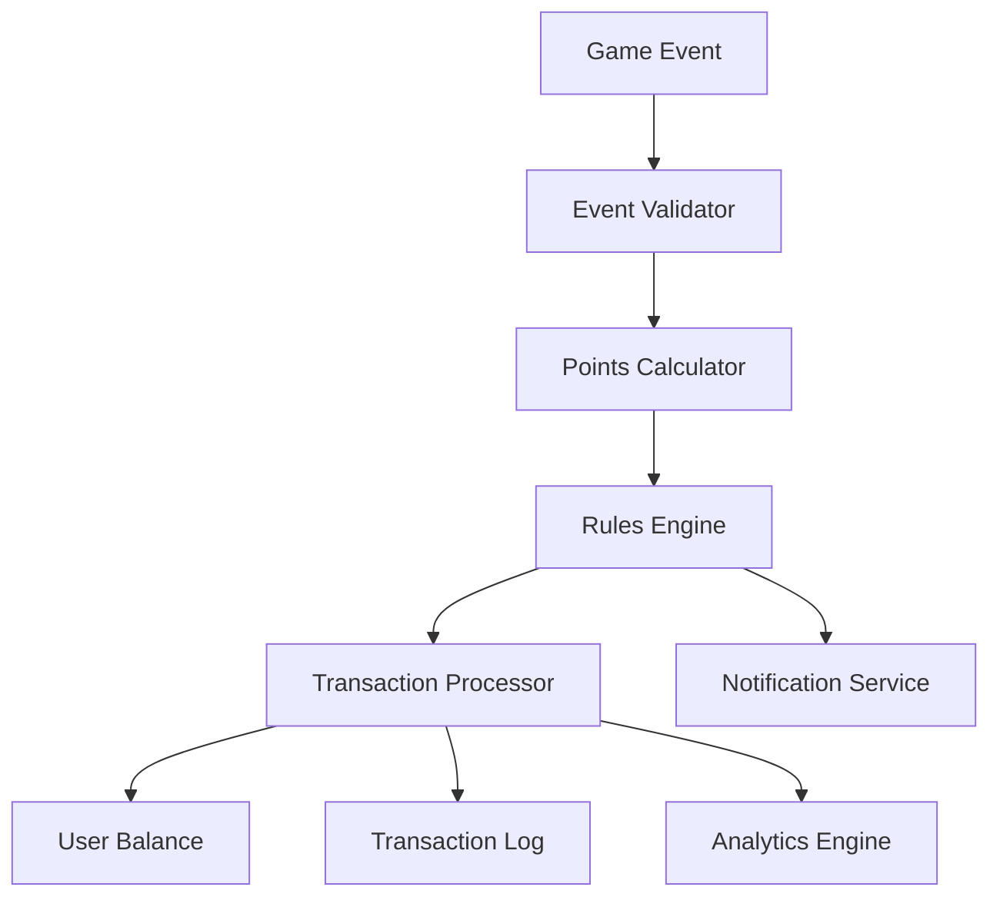
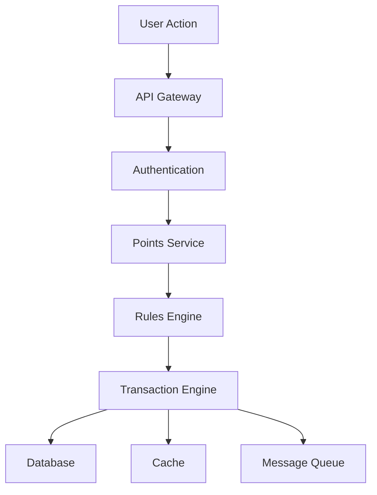

# Complete Store System Documentation

## Table of Contents
1. [System Overview](#1-system-overview)
2. [User Guide](#2-user-guide)
3. [Administrator Guide](#3-administrator-guide)
4. [API Reference](#4-api-reference)
5. [Points System](#5-points-system)
6. [Security Implementation](#6-security-implementation)
7. [Promotional System](#7-promotional-system)
8. [User Experience](#8-user-experience)
9. [Integration Guide](#9-integration-guide)
10. [Testing & QA](#10-testing--qa)
11. [Maintenance & Support](#11-maintenance--support)
12. [Business Rules](#12-business-rules)

---

# 1. System Overview

## Introduction
The store system is a sophisticated rewards and loyalty platform seamlessly integrated into the casino betting website. This comprehensive ecosystem enables users to earn, manage, and redeem points through various engagement activities while providing administrators with powerful tools for system management and analytics.

### Purpose & Goals
1. User Engagement
   - Encourage regular platform participation
   - Reward loyal users with meaningful incentives
   - Create an engaging shopping experience
   - Foster long-term user retention
   - Drive platform activity through rewards

2. Business Objectives
   - Increase user lifetime value
   - Enhance platform stickiness
   - Generate additional revenue streams
   - Create competitive advantages
   - Build brand loyalty

3. Technical Excellence
   - Scalable architecture
   - Real-time processing
   - High availability
   - Data security
   - Performance optimization

## Core Components

### 1. User Interface Layer
1. Store Front End
   - Responsive product grid with advanced filtering
   - Dynamic product detail pages with rich media
   - Real-time shopping cart management
   - Interactive points balance display
   - Comprehensive redemption history
   - Personalized recommendations engine
   - Social sharing capabilities
   - User reviews and ratings system

2. User Management
   - Profile customization
   - Preference settings
   - Notification management
   - Transaction history
   - Wishlist functionality
   - Account security settings

3. Mobile Experience
   - Native-like PWA functionality
   - Touch-optimized interfaces
   - Offline capabilities
   - Push notifications
   - Quick access features

### 2. Administrative Layer
1. Dashboard System
   - Real-time analytics dashboard
   - User behavior tracking
   - Sales and redemption metrics
   - Inventory management
   - Performance indicators
   - Automated reporting
   - Alert management

2. Content Management
   - Product catalog management
   - Category organization
   - Media asset management
   - Content scheduling
   - SEO optimization tools
   - Multi-language support

3. Operations Management
   - Order processing workflow
   - Inventory tracking
   - User support tools
   - Audit logging
   - System configuration
   - Access control

### 3. Points System Layer
1. Transaction Engine
   - Real-time points processing
   - Multi-currency support
   - Exchange rate management
   - Transaction validation
   - Fraud detection
   - Audit trailing

2. Rules Engine
   - Dynamic point calculation
   - Bonus rules processing
   - Promotion management
   - VIP tier rules
   - Expiration handling
   - Event-based triggers

3. Analytics Engine
   - User behavior analysis
   - Points economy metrics
   - Redemption patterns
   - Promotion effectiveness
   - System health monitoring
   - Predictive analytics

## System Architecture

### Component Architecture


### Data Flow Architecture


## Technical Infrastructure

### 1. Frontend Technologies
1. Core Framework
   - Next.js 13+ with App Router
   - React 18+ with Server Components
   - TypeScript for type safety
   - Redux Toolkit for state management
   - React Query for data fetching

2. UI/UX Components
   - React Bootstrap for layout
   - Tailwind CSS for styling
   - Custom component library
   - Material UI elements
   - Animation libraries

3. Performance Optimizations
   - Code splitting
   - Lazy loading
   - Image optimization
   - Browser caching
   - Service workers

### 2. Backend Services
1. API Layer
   - RESTful endpoints
   - GraphQL integration
   - WebSocket connections
   - Rate limiting
   - Request validation

2. Business Logic
   - Modular service architecture
   - Event-driven design
   - Caching strategies
   - Background processing
   - Error handling

3. Security
   - JWT authentication
   - Role-based access
   - API key management
   - Request encryption
   - Security headers

### 3. Database & Storage
1. Data Stores
   - PostgreSQL for transactions
   - Redis for caching
   - MongoDB for analytics
   - Elasticsearch for search
   - S3 for media storage

2. Data Management
   - Migration tools
   - Backup systems
   - Replication
   - Sharding
   - Data archival

### 4. DevOps & Infrastructure
1. Deployment
   - Docker containerization
   - Kubernetes orchestration
   - CI/CD pipelines
   - Environment management
   - Monitoring tools

2. Performance
   - Load balancing
   - CDN integration
   - Auto-scaling
   - Resource optimization
   - Performance monitoring

---

# 2. User Guide

## Getting Started
### Account Setup
1. Registration Process
   - Create an account on the casino platform
   - Complete KYC verification if required
   - Access the store through the main navigation
   - Initial welcome bonus: 1,000 points credited automatically

### User Dashboard
1. Points Overview
   - Current balance prominently displayed
   - Points earned today/this week/this month
   - Points expiring soon alerts
   - VIP tier progress indicator

2. Quick Actions
   - Redeem points
   - View rewards catalog
   - Check transaction history
   - Access promotional offers

## Store Navigation
### Main Interface
1. Header Section
   - Current points balance
   - Search bar for rewards
   - Shopping cart icon with real-time updates
   - Notifications center
   - Quick cart preview

### Shopping Cart System
1. Cart Management
   - Real-time cart updates
   - Multiple item selection
   - Point total calculation
   - Reserved points tracking
   - Cart expiration timer (30 minutes)

2. Cart Features
   - Save for later
   - Remove items
   - Quantity adjustments
   - Bundle handling
   - Price recalculation

3. Cart Security
   - Point reservation system
   - Inventory lock
   - Session management
   - Concurrent access handling

2. Filter Options
   - Category selection
   - Point range filter
   - Availability filter
   - Sort by: Newest/Popular/Points (Low to High)
   - VIP exclusive items filter

### Product Discovery
1. Featured Sections
   - New arrivals
   - Trending rewards
   - Limited time offers
   - Recommended for you
   - VIP exclusive section

2. Category Browse
   - Gaming accessories
   - Digital rewards
   - Exclusive merchandise
   - Virtual items
   - Real-world rewards

## Product Interaction
### Detailed View
1. Product Information
   - High-resolution images
   - 360° view (where available)
   - Detailed description
   - Terms of redemption
   - User reviews and ratings

2. Availability Details
   - Current stock status
   - Expected restock date
   - Regional availability
   - Delivery information
   - Redemption limitations

### Purchase Flow
1. Pre-Purchase
   - Point balance check
   - Eligibility verification
   - Terms acceptance
   - Quantity selection (if applicable)

2. Confirmation Process
   - Review order details
   - Confirm shipping info (physical items)
   - Final point deduction preview
   - Cancellation policy
   - Confirmation email

3. Post-Purchase
   - Order confirmation
   - Tracking information
   - Digital code delivery
   - Support contact
   - Feedback option

### Order Processing System
1. Order Creation
   - Cart validation
   - Point balance check
   - Inventory verification
   - Order ID generation
   - Payment processing

2. Order Fulfillment
   - Digital item delivery
   - Physical shipping integration
   - Status updates
   - Notification system
   - Tracking integration

3. Order Management
   - Order history
   - Status tracking
   - Cancellation handling
   - Return processing
   - Refund management

4. Order Analytics
   - Processing metrics
   - Fulfillment rates
   - Delivery performance
   - Customer satisfaction
   - Issue tracking

## Points System
### Earning Opportunities
1. Game Play
   - Base earnings: 1 point per $1 wagered
   - Win bonus: 10% of winnings in points
   - Tournament participation: bonus points
   - Achievement rewards
   - Daily challenges

2. Special Activities
   - Daily login streak: 50 points/day
   - Weekly challenges: up to 1,000 points
   - Monthly tournaments: bonus points
   - Social media interactions: 100 points
   - Friend referrals: 500 points per friend

3. Deposit Bonuses
   - First deposit: 200% in points
   - Regular deposits: 10% in points
   - VIP deposit bonus: up to 50%
   - Special event multipliers
   - Cryptocurrency bonus: extra 5%

### Points Management
1. Transaction History
   - Detailed earning records
   - Redemption history
   - Points expiration tracking
   - Category-wise breakdown
   - Exportable statements

2. Points Strategy
   - Optimal earning methods
   - VIP tier benefits
   - Point multiplier events
   - Strategic redemption tips
   - Points saving guides

## User Support
### Help Resources
1. Immediate Assistance
   - Live chat support
   - FAQ section
   - Video tutorials
   - Step-by-step guides
   - Common issues solved

2. Support Channels
   - 24/7 customer service
   - Email support
   - Phone support
   - Social media assistance
   - VIP concierge service

### Problem Resolution
1. Common Issues
   - Points not credited
   - Redemption failures
   - Order tracking
   - Account issues
   - Technical problems

2. Resolution Process
   - Ticket submission
   - Priority handling
   - Resolution tracking
   - Appeal process
   - Compensation policy

---

# 3. Administrator Guide

## Dashboard Overview
### Key Metrics
- Total active rewards
- Points in circulation
- Recent redemptions
- User engagement stats
- Popular products

### Quick Actions
- Add new rewards
- Manage existing rewards
- View reports
- Handle redemptions

## Reward Management
### Creating New Rewards
1. Navigate to Store > Rewards > Create New
2. Fill required fields:
   - Name
   - Description
   - Image
   - Point cost
   - Quantity
   - Start/End dates
   - Category
   - Status
3. Save and publish

### Editing Rewards
- Modify existing reward details
- Update availability
- Adjust point costs
- Change images
- Edit descriptions

---

# 4. API Reference

## API Architecture

### Overview
The API layer provides secure, scalable access to the store system's functionality through RESTful endpoints. All communications are encrypted and authenticated using multiple security layers.

### Design Principles
1. Security First
   - Multi-layer authentication
   - Request signing
   - Rate limiting
   - Input validation
   - Output sanitization

2. Performance
   - Response caching
   - Pagination
   - Compression
   - Efficient queries
   - Optimized payloads

3. Reliability
   - Error handling
   - Retry mechanisms
   - Circuit breakers
   - Fallback options
   - Health checks

## Authentication System

### Security Layers
1. JWT Token Authentication
```javascript
{
  "Authorization": "Bearer <jwt_token>",
  "Casino": "<casino_id>",
  "AuthKey": "<generated_auth_key>"
}
```

2. Request Signing
```javascript
const authKey = generateAuth({
  timestamp: Date.now(),
  casino: casinoId,
  nonce: generateNonce(),
  payload: requestBody
});
```

3. Rate Limiting
```javascript
{
  "X-RateLimit-Limit": "1000",
  "X-RateLimit-Remaining": "999",
  "X-RateLimit-Reset": "1626446400"
}
```

## API Endpoints

### Reward Management

1. List Rewards
```http
GET /api/reward/get-reward-list

Query Parameters:
- token: string           // API access token
- casino: string         // Casino identifier
- authKey: string       // Request signature
- page: number         // Page number (default: 1)
- limit: number       // Items per page (default: 20)
- filterType: string // Category filter
- searchName: string // Search term
- sortBy: string    // Sorting field
- order: string    // Sort order (asc/desc)
- status: string  // Active/Inactive/All

Response:
{
  "status": 200,
  "data": {
    "rewards": [
      {
        "id": string,
        "name": string,
        "description": string,
        "points": number,
        "quantity": number,
        "image": string,
        "category": string,
        "status": boolean,
        "startDate": string,
        "endDate": string
      }
    ],
    "pagination": {
      "currentPage": number,
      "totalPages": number,
      "totalItems": number,
      "itemsPerPage": number
    }
  }
}
```

2. Get Single Reward
```http
GET /api/reward/get-reward

Query Parameters:
- token: string      // API access token
- casino: string    // Casino identifier
- id: string       // Reward ID
- authKey: string // Request signature
- remoteId: string // User ID

Response:
{
  "status": 200,
  "data": {
    "id": string,
    "name": string,
    "description": string,
    "points": number,
    "quantity": number,
    "image": string,
    "category": string,
    "status": boolean,
    "startDate": string,
    "endDate": string,
    "terms": string,
    "redemptionInstructions": string,
    "userEligible": boolean,
    "userPoints": number
  }
}
```

3. Create Reward
```http
POST /api/reward/create

Request Body:
{
  "name": string,
  "description": string,
  "points": number,
  "quantity": number,
  "category": string,
  "startDate": string,
  "endDate": string,
  "image": File,
  "status": boolean,
  "terms": string,
  "redemptionInstructions": string
}

Response:
{
  "status": 200,
  "data": {
    "id": string,
    "message": "Reward created successfully"
  }
}
```

4. Update Reward
```http
PUT /api/reward/update/{id}

Request Body:
{
  "name": string,
  "description": string,
  "points": number,
  "quantity": number,
  "category": string,
  "startDate": string,
  "endDate": string,
  "image": File,
  "status": boolean,
  "terms": string,
  "redemptionInstructions": string
}

Response:
{
  "status": 200,
  "data": {
    "message": "Reward updated successfully"
  }
}
```

### Error Handling

1. Standard Error Response
```javascript
{
  "status": number,
  "error": {
    "code": string,
    "message": string,
    "details": object
  }
}
```

2. Error Codes
- 400: Bad Request
- 401: Unauthorized
- 403: Forbidden
- 404: Not Found
- 429: Too Many Requests
- 500: Internal Server Error

3. Error Recovery
- Retry strategies
- Fallback options
- Error reporting
- Monitoring alerts

---

# 5. Points System

## Points Architecture

### System Overview
The points system serves as the core economic engine of the platform, managing the entire lifecycle of points from earning to redemption. It ensures accurate, real-time tracking and processing of all point-related transactions while maintaining system integrity and user trust.

### Core Principles
1. Accuracy & Integrity
   - Real-time transaction processing
   - Double-entry accounting
   - Transaction atomicity
   - Data consistency
   - Audit trails

2. Scalability & Performance
   - Horizontal scaling
   - Load distribution
   - Caching strategies
   - Async processing
   - Performance monitoring

3. Security & Compliance
   - Transaction validation
   - Fraud detection
   - Regulatory compliance
   - Data protection
   - System auditing

## System Components

### 1. Points Ledger
1. Transaction Management
   - Real-time balance updates
   - Transaction categorization
   - Multi-currency support
   - Exchange rate handling
   - Reconciliation tools

2. Balance Tracking
   - Current balance
   - Pending points
   - Reserved points
   - Expired points
   - Bonus points

3. History Management
   - Detailed transaction logs
   - Audit trails
   - Report generation
   - Data archival
   - Recovery mechanisms

### 2. Points Rules Engine
1. Earning Rules
   - Base point calculations
   - Bonus multipliers
   - Special event rules
   - VIP tier benefits
   - Promotional rules

2. Redemption Rules
   - Eligibility checks
   - Point deduction logic
   - Confirmation process
   - Cancellation handling
   - Refund processing

3. System Rules
   - Point expiration
   - Daily limits
   - Category restrictions
   - User limitations
   - Geographic rules

## Integration Architecture

### 1. Game Integration


### 2. Platform Integration


## Transaction Processing

### 1. Point Earning Flow
1. Event Triggers
   - Game completion
   - Deposit made
   - Challenge achieved
   - Referral converted
   - Promotion activated

2. Processing Steps
   - Event validation
   - Rule application
   - Point calculation
   - Balance update
   - Notification dispatch

3. Verification
   - Double-entry check
   - Balance validation
   - Rule compliance
   - Fraud detection
   - System integrity

### 2. Point Redemption Flow
1. Pre-redemption
   - Balance check
   - Eligibility verification
   - Rule validation
   - Reservation creation
   - User confirmation

2. Redemption Process
   - Point deduction
   - Reward allocation
   - Transaction recording
   - Notification sending
   - Inventory update

3. Post-redemption
   - Confirmation
   - Receipt generation
   - Analytics update
   - History recording
   - Status tracking

## Analytics & Reporting

### 1. Real-time Analytics
1. System Metrics
   - Transaction volume
   - Point velocity
   - User activity
   - System performance
   - Error rates

2. Business Metrics
   - Point economy
   - User engagement
   - Redemption patterns
   - Promotion effectiveness
   - Revenue impact

### 2. Reporting Tools
1. Standard Reports
   - Daily transactions
   - User balances
   - Point economics
   - System health
   - Audit logs

2. Custom Analytics
   - User behavior
   - Trend analysis
   - Prediction models
   - ROI calculations
   - Risk assessment

---

# 6. Security Implementation

## Authentication & Authorization

### User Authentication
- JWT-based authentication
- Token refresh mechanism
- Session management
- Device tracking

### Admin Authorization
```javascript
// Role-based access control
const roles = {
  ADMIN: ['manage_rewards', 'view_reports', 'manage_points'],
  MANAGER: ['view_reports', 'manage_points'],
  SUPPORT: ['view_reports']
};
```

## Data Security

### Point Transaction Security
1. Transaction Validation
   - Point balance verification
   - Transaction limits
   - Duplicate prevention
   - Fraud detection

---

# 7. Promotional System

## Promo Code System

### Code Types
1. Standard Promo Codes
   - Fixed point value
   - Percentage bonus
   - Time-limited offers
   - First-time user codes

2. Special Event Codes
   - Tournament rewards
   - Holiday promotions
   - VIP exclusive codes
   - Milestone celebrations

## Campaign Management

### Campaign Creation
1. Setup Process
   - Campaign name
   - Duration
   - Target audience
   - Reward structure
   - Terms & conditions

---

# 8. User Experience

## Store Interface Design

### Layout Principles
1. Navigation
   - Clear category structure
   - Search functionality
   - Filter options
   - Sort capabilities

2. Product Display
   - Grid view
   - List view
   - Category grouping
   - Featured items

### Mobile Responsiveness
```css
/* Example responsive breakpoints */
@media (max-width: 768px) {
  .product-grid {
    grid-template-columns: repeat(2, 1fr);
  }
}

@media (max-width: 480px) {
  .product-grid {
    grid-template-columns: 1fr;
  }
}
```

---

# 9. Integration Guide

## Third-Party Integrations

### Payment Systems
1. Payment Processors
   - Credit card processing
   - Cryptocurrency
   - E-wallets
   - Bank transfers

2. Point Conversion
   - Currency to points
   - Points to currency
   - Exchange rates
   - Transaction fees

## External APIs

### Authentication
```javascript
const authenticate = async (apiKey, casinoId) => {
  const authKey = generateAuth(`casino=${casinoId}`);
  return {
    headers: {
      'Authorization': `Bearer ${apiKey}`,
      'Casino': casinoId,
      'AuthKey': authKey
    }
  };
};
```

---

# 10. Testing & QA

## Testing Strategy

### Unit Testing
```javascript
describe('ProductBox Component', () => {
  it('renders product details correctly', () => {
    const product = {
      name: 'Test Product',
      points: 100,
      image: 'test.jpg'
    };
    render(<ProductBox data={product} />);
    expect(screen.getByText('Test Product')).toBeInTheDocument();
  });
});
```

## Performance Testing

### Load Testing Scenarios
1. Normal Load
   - Average user count
   - Regular transaction volume
   - Standard operations
   - Background tasks

2. Peak Load
   - Maximum users
   - High transaction volume
   - Multiple operations
   - System limits

---

# 11. Maintenance & Support

## System Maintenance

### Inventory Management System
1. Stock Control
   - Real-time inventory tracking
   - Automatic restock alerts
   - Reserved item management
   - Stock level thresholds
   - Inventory reconciliation

2. Order Management
   - Order processing workflow
   - Status tracking system
   - Order confirmation
   - Delivery tracking
   - Return processing

3. Inventory Analytics
   - Stock level reporting
   - Demand forecasting
   - Popular items tracking
   - Restock optimization
   - Inventory health metrics

### Regular Maintenance
1. Daily Tasks
   - Database backups
   - Log rotation
   - Cache clearing
   - Error checking
   - Inventory sync

2. Weekly Tasks
   - Performance analysis
   - Security scans
   - Data cleanup
   - Report generation

### Emergency Procedures
1. System Outages
   - Detection
   - Communication
   - Resolution
   - Recovery

---

# 12. Business Rules

## Point System Rules

### Earning Points
1. Game Play
   - Base rate: 1 point per $1 wagered
   - Win bonus: 10% of win amount in points
   - Daily cap: 10,000 points
   - Minimum bet: $1

2. Promotions
   - Welcome bonus: 1,000 points
   - Daily login: 50 points
   - Referral bonus: 500 points
   - Special events: Variable

## VIP Program

### Tier Structure
1. Bronze
   - 0-5,000 points
   - Base earning rate
   - Standard support
   - Basic rewards

2. Silver
   - 5,001-20,000 points
   - 1.2x earning rate
   - Priority support
   - Enhanced rewards

3. Gold
   - 20,001-50,000 points
   - 1.5x earning rate
   - VIP support
   - Exclusive rewards

4. Platinum
   - 50,001+ points
   - 2x earning rate
   - Personal manager
   - Custom rewards
